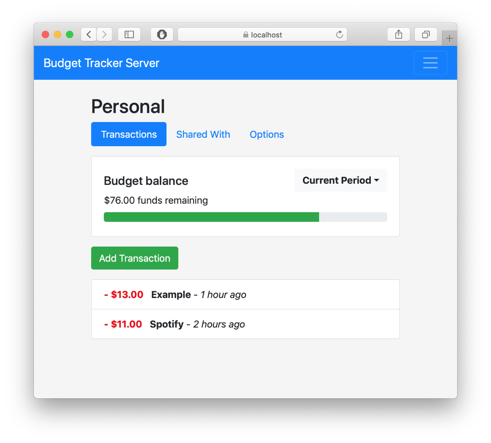

# Budget Tracker Server
Small web app programmed using Rust and JavaScript. Budgets can be shared amongst other users or be kept as private.

**Warning:** This is in its early stages of development and may not be fully secure or stable for every-day use.

<p align="center">

</p>

## Building
### Release Build
```
cargo build --release
```
### Debug Build
```
cargo build
```